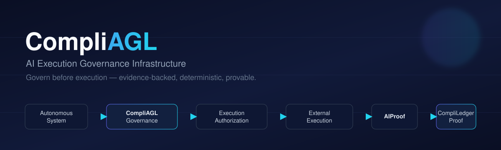
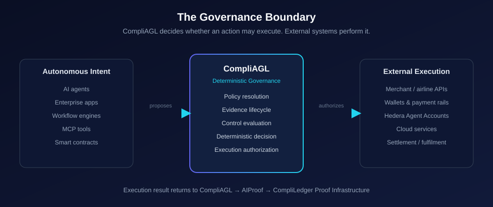
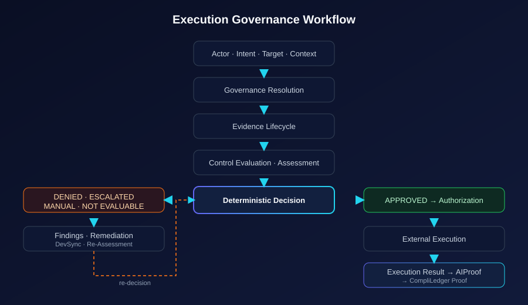
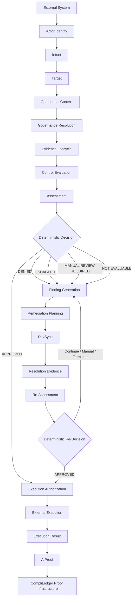
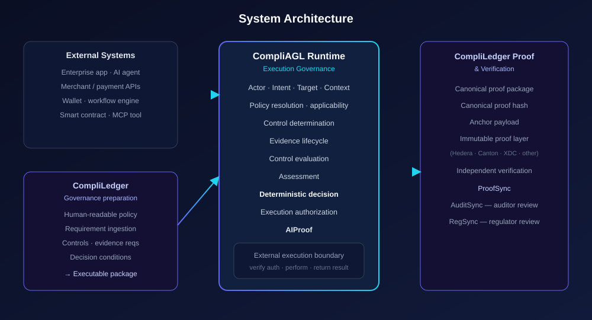
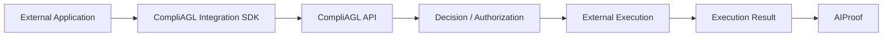
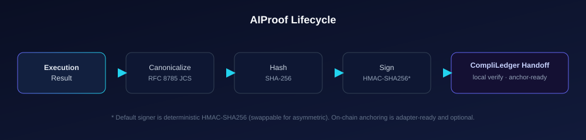

<!-- ─────────────────────────────  HERO  ───────────────────────────── -->
<div align="center">



<h1>CompliAGL</h1>

<h3>AI Execution Governance Infrastructure</h3>

<p><strong>Govern before execution.</strong> CompliAGL sits between autonomous systems and the external systems that actually execute — and deterministically decides whether a proposed action may proceed, <em>before</em> it happens.</p>

<p>
<a href="#-local-development">Quickstart</a> ·
<a href="#-execution-governance-workflow">How it works</a> ·
<a href="#-capabilities-and-implementation-status">What's built</a> ·
<a href="./ROADMAP.md">Roadmap</a> ·
<a href="./docs/architecture.md">Architecture docs</a>
</p>

<p>

<a href="./LICENSE"></a>


</p>

<sub>Static, descriptive badges only. There is no CI workflow, published release, or published SDK in this repository, so no build/release/package badges are shown.</sub>

</div>

---

## Overview

CompliAGL answers a single question:

> **How should an autonomous system determine whether a proposed action may execute under the current policies, evidence, controls, and operational conditions?**

Identity and permissions tell you *who* is acting and *what* they are broadly allowed to do. They do **not** tell you whether a *specific* action should occur *right now*, given current policy, validated evidence, and operational context. CompliAGL is the reusable governance boundary that makes that determination deterministically, and produces an **AIProof** of the outcome.

Responsibilities are cleanly separated:

- **CompliLedger** converts human-readable governance into **executable governance packages**.
- **CompliAGL** applies those packages at runtime to an actor, intent, target, and context.
- **External systems** perform the underlying action.
- **CompliAGL** receives the execution result and generates **AIProof**.
- **CompliLedger Proof Infrastructure** converts AIProof into machine-verifiable proof.

<table>
<tr>
<td width="33%" valign="top">

### ❌ The Problem

Autonomous systems can call APIs, spend funds, invoke tools, interact with merchants, and execute transactions — but identity and permissions alone do not determine whether a *specific* action should occur under *current* conditions.

</td>
<td width="33%" valign="top">

### ✅ The Solution

CompliAGL evaluates actor identity, intent, target, current operational context, applicable governance, controls, and validated evidence before producing an explicit **deterministic decision**.

</td>
<td width="33%" valign="top">

### ⭐ Why CompliAGL

It provides a reusable governance boundary between autonomous intent and external execution — **without** replacing identity systems, wallets, merchants, payment rails, enterprise applications, or blockchains.

</td>
</tr>
</table>

> [!IMPORTANT]
> **CompliAGL governs execution; it does not perform the underlying commercial or operational function.**
> External systems perform bookings, payments, API calls, workflows, smart-contract actions, settlement, and fulfillment. CompliAGL determines whether execution may proceed, issues authorization, receives the result, and generates AIProof.

### What CompliAGL is **not**

CompliAGL is **not** a booking or airline platform, a merchant platform, a wallet, a payment processor, a settlement network, a blockchain, a product catalog, an inventory system, or a fulfillment platform. Those functions belong to the **external execution systems** it governs.

---

## 🧭 Architectural boundary

<div align="center">

</div>

| Layer | Owns | Does **not** own |
|-------|------|------------------|
| **CompliLedger** | Human-governance → executable packages; proof canonicalization, anchoring, verification | Runtime execution decisions |
| **CompliAGL** | Runtime evaluation, deterministic decision, execution authorization, AIProof generation | Funds, accounts, merchant transactions, settlement |
| **External systems** | Identity/wallets, merchant/airline APIs, payment rails, workflow engines, smart contracts, fulfillment | The governance decision |

---

## 🔀 Execution governance workflow

<div align="center">

</div>

A request enters from an external system and flows through the runtime. **Only an APPROVED decision may issue execution authorization.**



<details>
<summary><strong>Full canonical architecture (target model)</strong></summary>

This is the canonical, end-to-end model. Not every stage below is fully implemented today — see [Capabilities and implementation status](#-capabilities-and-implementation-status).

```mermaid
flowchart TD
    id[Actor Identity] --> intent[Intent] --> target[Target] --> ctx[Current Operational Context]
    ctx --> reason[Deterministic Reasoning] --> pres[Policy Resolution] --> appl[Applicability Evaluation]
    appl --> ctrld[Control Determination] --> evreq[Evidence Requirements] --> evorc[Evidence Orchestration]
    evorc --> evval[Evidence Validation] --> evnorm[Evidence Normalization] --> evsuf[Evidence Sufficiency]
    evsuf --> ceval[Control Evaluation] --> assess[Assessment] --> decision{Deterministic Decision}

    decision -->|APPROVED / Assessment Satisfied| auth[Execution Authorization]
    decision -->|DENIED / ESCALATED / Manual / Not Evaluable| finding[Finding Generation]

    finding --> remplan[Remediation Planning] --> devsync[DevSync] --> remtrack[Remediation Tracking]
    remtrack --> rescollect[Resolution Evidence Collection] --> resval[Resolution Validation]
    resval --> reassess[Re-Assessment] --> redecision{Deterministic Re-Decision}
    redecision -->|APPROVED| auth
    redecision -->|Continue / Manual / Terminate| finding

    auth --> extsys[External Execution System] --> exec[Execution] --> result[Execution Result]
    result --> aiproof[AIProof] --> proofinfra[CompliLedger Proof Infrastructure]
    proofinfra --> canpkg[Canonical Proof Package] --> canhash[Canonical Proof Hash]
    canhash --> anchor[Anchor Payload] --> immut[Immutable Proof Layer<br/>Hedera · Canton · XDC · other DLTs]
    immut --> indep[Independent Verification] --> proofsync[ProofSync]
    proofsync --> auditsync[AuditSync]
    proofsync --> regsync[RegSync]
    proofsync --> assurance[Reusable Operational Assurance] --> monitor[Continuous Monitoring]
    monitor --> reeval{Change detected?} -->|yes| reason
```



</details>

---

## 🛫 Example governed action

> This is an **illustrative** example of an *external* action. CompliAGL does **not** search flights, store travel inventory, hold funds, process payments, or complete bookings.

**Actors and systems (all external to CompliAGL):**

- **External Travel Application** — identifies a flight offer and drives UX.
- **External Merchant or Airline API** — sells and issues the ticket.
- **External Wallet or Payment Rail** — holds funds and settles the payment.

**Example human-readable policy** (owned and published by CompliLedger, not authored in CompliAGL):

- Employees may book domestic economy travel on approved airlines.
- The total fare may not exceed **$750** without manager approval.
- International travel requires prior authorization.
- Airlines not on the approved vendor list are prohibited.
- Travel must originate from and arrive at approved locations.

CompliLedger ingests this policy and publishes an **executable governance package** to CompliAGL.

**Sequence:**

1. An external travel application identifies a flight offer.
2. An agent proposes purchasing it.
3. The Integration SDK submits **actor, intent, target, and context** to CompliAGL.
4. CompliAGL resolves the applicable executable governance package.
5. Evidence is orchestrated, validated, normalized, and evaluated for sufficiency.
6. Controls are evaluated.
7. CompliAGL returns **APPROVED**, **DENIED**, or **ESCALATED**.
8. If approved, CompliAGL issues **signed execution authorization**.
9. External travel, wallet, payment, and merchant systems execute.
10. The execution result returns to CompliAGL.
11. CompliAGL generates **AIProof**.
12. CompliLedger produces machine-verifiable proof.

<details>
<summary><strong>Illustrative intent payload</strong> (shape only — not a verified schema)</summary>

```jsonc
// Illustrative only. The authoritative request/response shapes are defined by
// the FastAPI schemas under backend/app/schemas/ and served at /docs.
{
  "actor_identity_id": "…",
  "intent": { "action": "purchase_flight", "vendor": "AA", "amount_minor": 74900, "currency": "USD" },
  "target": { "type": "airline_api", "reference": "offer-123" },
  "operational_context": { "trip_type": "domestic", "origin": "SFO", "destination": "JFK" }
}
```

</details>

---

## 🏛 System architecture

```mermaid
flowchart LR
    subgraph EXT[External Systems]
        A1[Enterprise App]
        A2[AI Agent]
        A3[Merchant API]
        A4[Payment / Wallet]
        A5[Workflow Engine]
        A6[Smart Contract]
        A7[MCP Tool]
    end

    subgraph CL[CompliLedger — Governance Preparation]
        P1[Human-readable policies] --> P2[Requirement ingestion]
        P2 --> P3[Machine-readable requirements]
        P3 --> P4[Applicability logic + controls]
        P4 --> P5[Evidence requirements + decision conditions]
        P5 --> P6[Executable governance package]
    end

    subgraph AGL[CompliAGL — Runtime Execution Governance]
        R1[Actor · Intent · Target · Context]
        R1 --> R2[Policy resolution + applicability]
        R2 --> R3[Control determination]
        R3 --> R4[Evidence lifecycle]
        R4 --> R5[Control evaluation + assessment]
        R5 --> R6{Decision}
        R6 --> R7[Execution authorization]
        R7 --> R8[AIProof]
    end

    subgraph XE[External Execution]
        E1[Verify authorization] --> E2[Perform action] --> E3[Return result]
    end

    subgraph PROOF[CompliLedger — Proof & Verification]
        F1[Canonical proof package] --> F2[Canonical proof hash]
        F2 --> F3[Anchor payload] --> F4[Immutable proof layer]
        F4 --> F5[Independent verification] --> F6[ProofSync]
        F6 --> F7[AuditSync]
        F6 --> F8[RegSync]
    end

    EXT --> R1
    P6 --> R2
    R7 --> E1
    E3 --> R8
    R8 --> F1
```

<div align="center">

</div>



---

## 🧱 Core architectural layers

### Executable Governance Packages
CompliLedger transforms human-language governance into approved, versioned, machine-readable packages containing applicability logic, controls, evidence requirements, and explicit decision conditions. CompliAGL exposes intake, validate, approve, publish, supersede, and retire operations for these packages. **Status: ✅ implemented (intake side).**

### Deterministic Runtime Governance
CompliAGL applies the published package to the actor, intent, target, and current context using explicit decision conditions — **no probabilistic approval logic**. **Status: ✅ implemented.**

### Evidence-Backed Evaluation
Evidence requirements drive orchestration → validation → normalization → sufficiency, which feeds control evaluation. Evidence collection today runs through **simulator connectors**; the pipeline and models are persistent and real. **Status: ✅ pipeline implemented; 🧪 connectors are simulated.**

### Execution Authorization
An approved decision produces a **bounded, time-limited, narrowly scoped** authorization for an external system, signed and independently verifiable, with consume/revoke semantics. **Status: ✅ implemented.**

### External Execution Boundary
CompliAGL does **not** perform the booking, payment, sale, settlement, fulfillment, tool invocation, or business operation. It verifies and issues authorization; external systems execute and return a result. **Status: ✅ boundary enforced by design; ⚠️ execution adapters are mock/partial.**

### AIProof
AIProof records the governance lifecycle, authorization, and execution result, then becomes input to CompliLedger Proof Infrastructure. Generation uses **RFC 8785 (JCS)** canonicalization, **SHA-256** hashing, and a default **HMAC-SHA256** signer, with local independent verification. **Status: ✅ implemented (local); ⚠️ on-chain anchoring adapter-ready.**

### Findings, Remediation, and DevSync
Unresolved or remediable conditions create findings and remediation workflows before reassessment. DevSync dispatch uses an **in-memory adapter by default**, with a pluggable registry for a real integration. **Status: ✅ findings/remediation implemented; ⚠️ DevSync adapter is in-memory.**

### Continuous Monitoring
Changes to policy, context, evidence, finding, remediation, authorization, or execution result may trigger re-evaluation via change detection and re-evaluation jobs. **Status: ✅ implemented in-process; 🚧 reusable operational assurance in development.**

---

## ✅ Capabilities and implementation status

Statuses are derived from source, migrations, routes, and tests — **not** from documentation.

**Legend:** ✅ Implemented · 🧪 Prototype · ⚠️ Partial / adapter-ready · 🚧 In development · 🧭 Planned

| Capability | Status | Notes |
|------------|:------:|-------|
| Actor & agent identity | ✅ | Persistent `ActorIdentity`; credential types incl. DID/VC/Hedera account enums |
| Intent | ✅ | `/api/v1/intents` |
| Target | ✅ | `/api/v1/targets` |
| Operational context | ✅ | `/api/v1/operational-contexts` |
| Executable governance package intake | ✅ | validate / approve / publish / supersede / retire |
| Policy resolution | ✅ | `policy_resolution_service` |
| Applicability evaluation | ✅ | `applicability_service` |
| Control determination | ✅ | `control_determination_service` |
| Evidence orchestration | ✅ | Plans/jobs persisted |
| Evidence validation | ✅ | `evidence_validation_service` |
| Evidence normalization | ✅ | `evidence_normalization_service` |
| Evidence sufficiency | ✅ | `evidence_sufficiency_service` |
| Evidence collection connectors | 🧪 | Simulator connectors (`services/evidence/connectors/simulators.py`) |
| Control evaluation | ✅ | `control_evaluation_service` |
| Assessment | ✅ | `assessment_service` |
| Deterministic decision | ✅ | `decision_service` + deterministic expression engine |
| APPROVED / DENIED / ESCALATED outcomes | ✅ | Plus manual-review / not-evaluable paths |
| Execution authorization | ✅ | Signed, TTL-bounded, issue/verify/consume/revoke |
| Integration SDK (TypeScript / Python) | 🧪 | Source + tests, v0.1.0, **unpublished** |
| External execution-result ingestion | ✅ | `ExternalExecutionResult` model + routes |
| AIProof (canonicalize / hash / sign / verify) | ✅ | RFC 8785, SHA-256, HMAC-SHA256 default, local verify |
| CompliLedger proof handoff | ✅ | Local handoff contract for dev; no external endpoint |
| Findings | ✅ | `finding_service` |
| Remediation | ✅ | `remediation_service` + resolution evidence |
| DevSync | ⚠️ | In-memory adapter by default; pluggable |
| Execution adapters (x402 / mock) | ⚠️ | x402 with **mock facilitator** default; mock adapter |
| Execution adapter (Solana) | 🧭 | Placeholder — not implemented |
| Hedera HCS anchoring | 🧭 | Absent (Hedera only as identity credential type) |
| Algorand anchoring | ⚠️ | Optional external adapter; skipped (`anchored: false`) when absent |
| Mirror Node verification | 🧭 | Absent |
| ProofSync / AuditSync / RegSync | ✅ | Scoped, signed integration-event outbox (in-process) |
| Continuous monitoring | ✅ | Change detection + re-evaluation jobs |
| Production authentication | 🧭 | Current auth is a placeholder API-key + header org id |

---

## 🔌 Integration model



The SDK contains **no governance logic**. It transports typed data and may handle authentication (bearer token + `X-Organization-Id`), retries with backoff, idempotency keys, authorization verification, result submission, and proof retrieval. Two SDKs exist in source — TypeScript (`@compliagl/sdk`) and Python (`compliagl-sdk`) — both at **v0.1.0 and not yet published** to npm/PyPI. See [`sdk/`](./sdk).

| Component | Responsibility |
|---|---|
| External application | User experience and business workflow |
| CompliLedger | Converts human governance into executable packages |
| CompliAGL | Runtime evaluation and execution authorization |
| Wallet, payment platform, or Hedera Agent Accounts | Identity, accounts, funds, allowances, and payment execution |
| Merchant or external system | Performs the transaction or operation |
| CompliLedger Proof Infrastructure | Proof canonicalization, anchoring, and verification |

---

## ⭐ Strategic differentiators

<table>
<tr>
<td width="25%" valign="top">

### 1. Deterministic Execution Governance
Explicit decision conditions, not probabilistic approval. The same inputs yield the same decision.

</td>
<td width="25%" valign="top">

### 2. Evidence-Backed Authorization
Consequential decisions require orchestrated, validated, normalized, and **sufficient** evidence.

</td>
<td width="25%" valign="top">

### 3. Separation of Governance and Execution
CompliAGL decides; external systems execute. The boundary is enforced by design.

</td>
<td width="25%" valign="top">

### 4. AIProof & Machine-Verifiable Proof
Every governed outcome yields a canonical, signed, locally verifiable AIProof for CompliLedger.

</td>
</tr>
</table>

CompliAGL is designed to be **framework-, chain-, and execution-system agnostic**. Today that agnosticism is expressed through interfaces and adapter seams — support is limited to the implemented adapters (x402 + mock) and the optional external Algorand adapter. It is not a claim of broad live integration.

---

## 🗂 Category position

| Capability | Identity / IAM | Wallet / Agent Account | Merchant / Payment | AI Governance Docs Platform | **CompliAGL** |
|---|:---:|:---:|:---:|:---:|:---:|
| Establishes who is acting | ✅ | ⚠️ | — | — | consumes it |
| Holds or transfers funds | — | ✅ | ✅ | — | ❌ |
| Performs the underlying transaction | — | ⚠️ | ✅ | — | ❌ |
| Documents governance | — | — | — | ✅ | consumes it |
| Evaluates whether a *specific* action may execute | — | — | — | — | ✅ |
| Requires validated evidence | — | — | — | ⚠️ | ✅ |
| Produces deterministic runtime authorization | — | — | — | — | ✅ |
| Generates AIProof | — | — | — | — | ✅ |

> [!NOTE]
> CompliAGL complements identity systems, Hedera Agent Accounts, payment rails, merchants, AI frameworks, and enterprise applications. It does not replace them.

---

## 📜 Product philosophy

> **No autonomous execution without governance.**

> **No consequential decision without validated and sufficient evidence.**

> **No approval without explicit deterministic decision conditions.**

> **No external execution without valid execution authorization.**

> **No governed outcome without AIProof.**

> **Governance should remain aligned with current reality.**

---

## 🔎 Current implementation and known limitations

<div align="center">

</div>

**Implemented today (verified in source):**

- Canonical runtime domain (actor, intent, target, context, decision, authorization, AIProof) persisted via SQLAlchemy with Alembic migrations under `backend/migrations/`.
- Deterministic decision engine and deterministic expression evaluation.
- Governance-package intake, policy resolution, applicability, control determination and evaluation, assessment.
- Evidence lifecycle (orchestration → validation → normalization → sufficiency).
- Signed, TTL-bounded execution authorization (issue / verify / consume / revoke).
- AIProof canonicalization (RFC 8785), SHA-256 hashing, HMAC-SHA256 signing, and **local** independent verification.
- Findings, remediation, resolution-evidence validation, re-assessment, and re-decision.
- ProofSync / AuditSync / RegSync scoped, signed integration-event outbox.
- Continuous monitoring, change detection, and automated re-evaluation.
- **291 backend tests pass** (see [Testing](#-testing)).

**Prototype / simulated / partial:**

- **Evidence connectors are simulated** (`services/evidence/connectors/simulators.py`).
- **Execution adapters:** x402 uses a **mock facilitator by default** (`X402_MOCK_MODE=true`); the mock adapter returns synthetic confirmations; the Solana adapter is a placeholder.
- **DevSync** uses an in-memory adapter by default.
- **SDKs** (TypeScript & Python) exist in source with tests but are **unpublished** (v0.1.0).
- **`Compli402`** demo surface is built on the **deprecated in-memory MVP2 path** and a mock x402 facilitator.

**Runtime / deployment caveats:**

- Default persistence is **SQLite**; `app.main` creates tables via `create_all` on boot (migrations not required locally, and multiple `0010_*` revisions exist in `backend/migrations/`).
- Demo actors and a demo travel policy are **seeded on every boot** (`app/db/seed.py`).
- **Authentication is a placeholder** (`SECRET_KEY` API-key check); tenant isolation is a required `X-Organization-Id` header; CORS is fully permissive. See [SECURITY.md](./SECURITY.md).
- **On-chain anchoring is adapter-ready but optional.** The `compliledger-algorand-adapter` is **not** in this repository; when absent, proofs are returned with `anchored: false`. There is **no live Hedera Mainnet/HCS, Mirror Node, Canton, or XDC integration**.
- **AIProof verification is local** (re-derives hashes and checks the signature). This is *not* independent on-chain verification and is *not* equivalent to retrieving stored proof from a DLT.

**Known production blockers:** placeholder authentication, permissive CORS, simulated evidence connectors, mock execution/payment, optional (frequently absent) anchoring, unpublished SDKs, and the still-mounted deprecated MVP2 surface.

---

## 🛣 Roadmap

A phased roadmap with per-item status is maintained in **[ROADMAP.md](./ROADMAP.md)** — Phase 1 (Canonical Runtime Foundation) through Phase 6 (Continuous Assurance).

---

## 🧰 Technology stack

Only technologies present in the repository are listed.

| Layer | Technology | Notes |
|-------|------------|-------|
| Backend language | Python 3.10+ | `backend/` |
| API framework | FastAPI + Uvicorn | `app.main` |
| Data validation | Pydantic v2 / pydantic-settings | schemas + settings |
| ORM | SQLAlchemy 2.0 | `app/models` |
| Database | SQLite (default) | `sqlite:///./compliagl.db` |
| Migrations | Alembic | `backend/migrations/` |
| Testing (backend) | pytest + FastAPI `TestClient` (httpx) | not pinned in `requirements.txt` |
| Proof canonicalization & hashing | RFC 8785 (JCS) + SHA-256 | `services/canonical/aiproof/` |
| Proof / authorization / event signing | HMAC-SHA256 (default; swappable) | env-backed keys |
| Execution adapters | x402 (mock default), mock, Solana (placeholder) | `app/mvp2/execution/adapters/` |
| DLT adapter | Algorand via optional external `compliledger-algorand-adapter` | not bundled |
| Frontend | Next.js + React + TypeScript + Tailwind | `CompliAgl-Frontend/` |
| SDKs | TypeScript (`@compliagl/sdk`), Python (`compliagl-sdk`) | v0.1.0, unpublished |
| Deployment config | Procfile + `backend/railway.json` (Railway/NIXPACKS) | present, not verified live |
| CI | *none* | no `.github/workflows` in repo |

---

## 💻 Local development

Full, verified steps are in **[QUICKSTART.md](./QUICKSTART.md)**. Summary:

```bash
# Clone
git clone https://github.com/Compliledger/CompliAGL.git
cd CompliAGL

# Backend
cd backend
python -m venv venv && source venv/bin/activate   # Windows: venv\Scripts\activate
pip install -r requirements.txt
cp .env.example .env                               # optional; SQLite defaults work
uvicorn app.main:app --reload --port 8000          # API + OpenAPI docs at /docs

# Frontend (separate terminal)
cd ../CompliAgl-Frontend
npm install
npm run dev                                        # Next.js on http://localhost:3000
```

- **API docs:** <http://localhost:8000/docs> (OpenAPI / Swagger UI)
- **Health:** <http://localhost:8000/health>
- **Canonical API:** served under `/api/v1`
- **Demo flow:** `/api/compli402` (mock x402 facilitator by default) — see [`docs/demo-flow.md`](./docs/demo-flow.md)

> The root `Makefile` targets `frontend/` and port `5173`, which do **not** match this repository (the frontend is `CompliAgl-Frontend/` on port `3000`). Use the commands above or in QUICKSTART.

---

## 🧪 Testing

Backend tests use pytest and FastAPI's `TestClient`. **`pytest` and `httpx` are not pinned in `backend/requirements.txt`**, so install them first:

```bash
cd backend
pip install pytest httpx
python -m pytest -q
```

**Last verified run in this environment:**

- Command: `python -m pytest -q` (from `backend/`)
- Result: **291 passed**, 0 failed, **1 warning** (`PendingDeprecationWarning` from Starlette's multipart import), in ~26s.

The frontend has **no automated test suite**. It provides quality scripts instead:

```bash
cd CompliAgl-Frontend
npm run lint
npm run typecheck
npm run format:check
```

---

## 📚 Documentation

| Document | Description |
|----------|-------------|
| [QUICKSTART.md](./QUICKSTART.md) | Verified setup, run, and test commands |
| [ROADMAP.md](./ROADMAP.md) | Phased roadmap with per-item status |
| [SECURITY.md](./SECURITY.md) | Security posture and current limitations |
| [CONTRIBUTING.md](./CONTRIBUTING.md) | Contribution guidelines |
| [docs/architecture.md](./docs/architecture.md) | System architecture overview |
| [docs/architecture/AIPROOF.md](./docs/architecture/AIPROOF.md) | AIProof structure and generation |
| [docs/INTEGRATION_CONTRACTS.md](./docs/INTEGRATION_CONTRACTS.md) | ProofSync / AuditSync / RegSync contracts |
| [docs/demo-flow.md](./docs/demo-flow.md) | Approved / denied / escalated demo flows |
| [docs/schemas/aiproof-1.0.0.schema.json](./docs/schemas/aiproof-1.0.0.schema.json) | AIProof JSON Schema (v1.0.0) |
| [backend/README.md](./backend/README.md) | Backend service reference |
| [sdk/README.md](./sdk/README.md) | Integration SDK overview |

---

## 🤝 Contributing & security

- Contribution guidelines: **[CONTRIBUTING.md](./CONTRIBUTING.md)**
- Security posture and reporting: **[SECURITY.md](./SECURITY.md)**

Please keep documentation and status labels honest — mocks, stubs, and in-memory defaults must be labeled as such.

---

<!-- ─────────────────────────────  FOOTER  ───────────────────────────── -->
<div align="center">

<sub><strong>CompliAGL</strong> — AI Execution Governance Infrastructure · Govern before execution.</sub>

<br/>

<sub>Licensed under the <a href="./LICENSE">MIT License</a>. Status: active development / proof of concept.</sub>

<br/>

<sub>CompliAGL governs execution. External systems perform the underlying action. CompliLedger converts AIProof into machine-verifiable proof.</sub>

</div>
